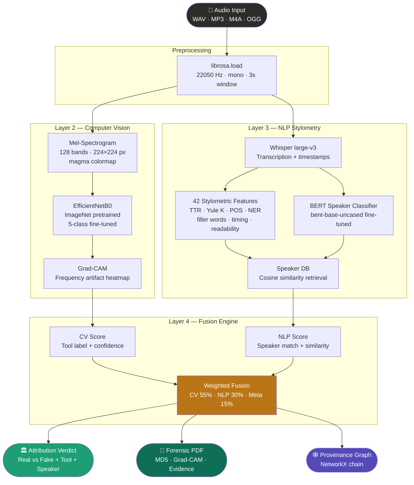
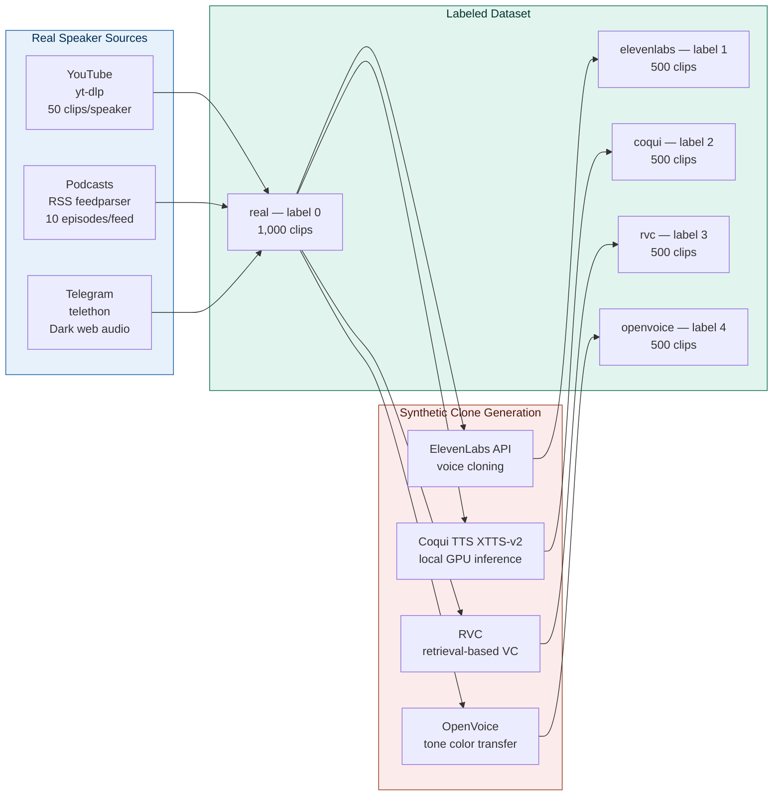
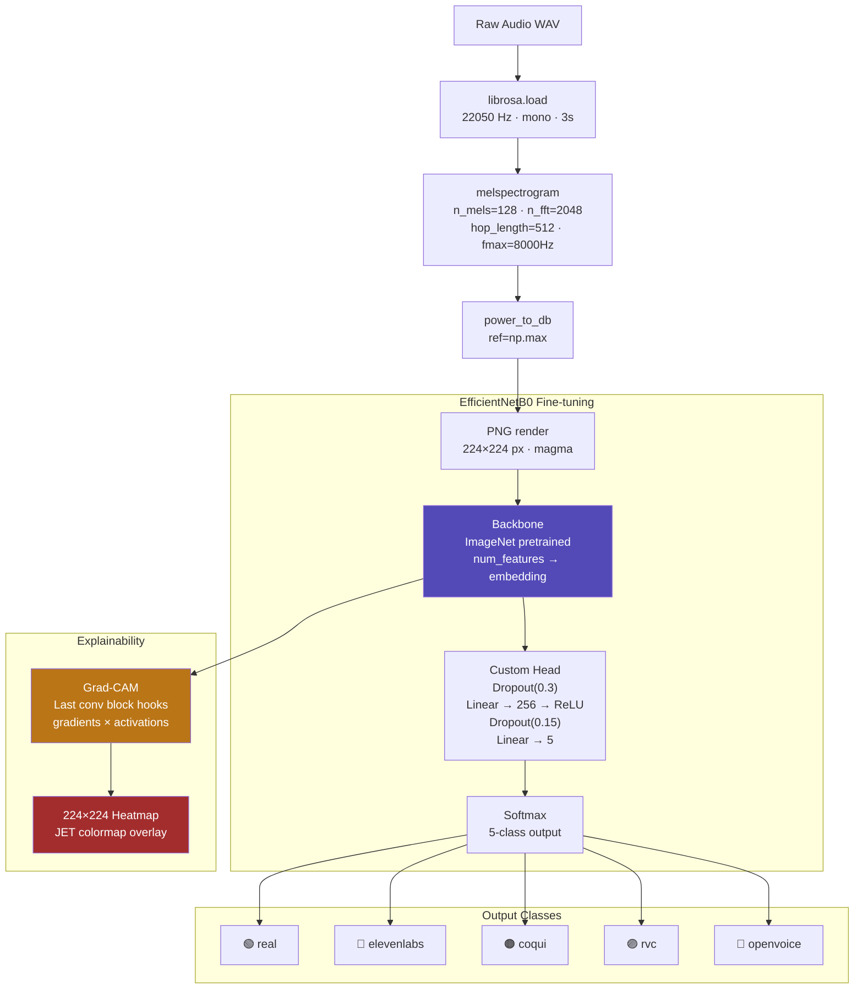
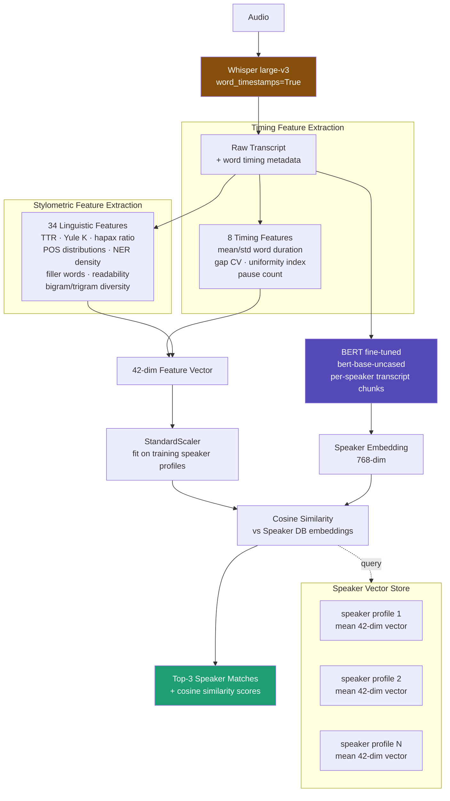
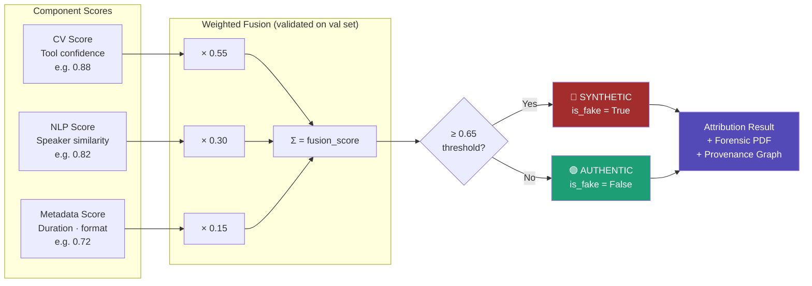
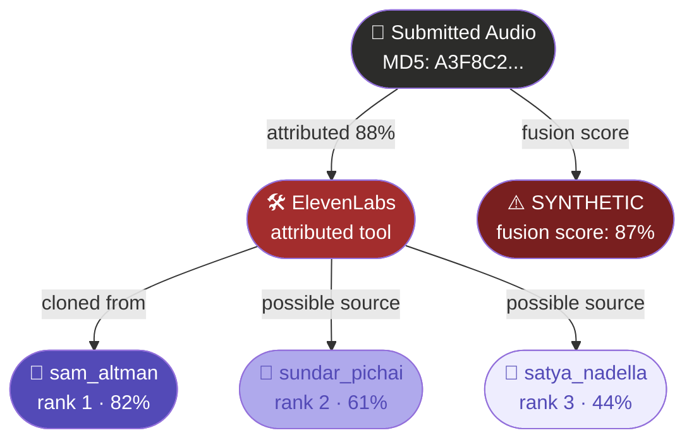

<div align="center">

# 🎙️ VoiceTraceAI

### *Multimodal Voice Clone Attribution via Spectral Computer Vision + NLP Stylometry*

[](https://python.org)
[](https://pytorch.org)
[](https://gradio.app)
[](LICENSE)
[]()

**Author:** [Shivani Bhat](https://github.com/shivanibhat24) &nbsp;·&nbsp; **Date:** 20 March 2026 &nbsp;·&nbsp; **Version:** 1.0.0

[Overview](#-overview) &nbsp;·&nbsp; [Architecture](#-system-architecture) &nbsp;·&nbsp; [Quickstart](#-quickstart) &nbsp;·&nbsp; [Benchmarks](#-benchmarks) &nbsp;·&nbsp; [API](#-api-reference) &nbsp;·&nbsp; [Citation](#-citation)

</div>

---

## 🔍 Overview

**VoiceTraceAI** is the first open-source system to jointly solve three forensic problems about AI-generated audio in a single pipeline,

### Four Technology Layers

```
Web Scraping  →  Computer Vision  →  NLP Stylometry  →  Cybersecurity Fusion
  yt-dlp            EfficientNetB0       Whisper + BERT       Weighted attribution
  telethon          Mel-spectrograms     42 features          Forensic PDF
  feedparser        Grad-CAM heatmaps    Speaker vector DB    Provenance graph
```

---

## 🏗️ System Architecture

### 1. End-to-End Pipeline



---

### 2. Layer 1 — Web Scraping & Dataset Construction



**Dataset breakdown:**

| Split | real | elevenlabs | coqui | rvc | openvoice | **Total** |
|---|---|---|---|---|---|---|
| Train (70%) | 700 | 350 | 350 | 350 | 350 | **2,100** |
| Val (15%) | 150 | 75 | 75 | 75 | 75 | **450** |
| Test (15%) | 150 | 75 | 75 | 75 | 75 | **450** |
| **Total** | **1,000** | **500** | **500** | **500** | **500** | **3,000** |

---

### 3. Layer 2 — Spectral Computer Vision



**Training configuration:**

| Hyperparameter | Value |
|---|---|
| Architecture | EfficientNetB0 (timm) |
| Pretrained weights | ImageNet-1K |
| Input resolution | 224 × 224 × 3 |
| Optimizer | AdamW (lr=3e-4, wd=0.01) |
| Scheduler | CosineAnnealingLR (T_max=30) |
| Loss | CrossEntropyLoss (label_smoothing=0.1) |
| Batch size | 32 (class-balanced WeightedRandomSampler) |
| Dropout | 0.3 (head), 0.15 (intermediate) |
| Epochs | 30 |
| Mixed precision | ✅ torch.amp.GradScaler |

**Spectral Artifact Atlas — per-tool frequency signatures:**

| Tool | Artifact Type | Frequency Band | Visual Indicator |
|---|---|---|---|
| 🟢 Real | Natural harmonic decay | Full spectrum | No anomalous region |
| 🔴 ElevenLabs | High-frequency suppression | **6–9 kHz** | Upper-band energy dropout |
| 🟠 Coqui TTS | Formant phase smearing | **1–3 kHz** | Mid-band blurring |
| 🟣 RVC | Pitch-correction ridges | **Harmonic multiples** | Vertical stripe artifacts |
| 🔵 OpenVoice | Tone-color resonance peaks | **2–5 kHz** | Mid-band standing waves |

---

### 4. Layer 3 — NLP Stylometric Fingerprinting



<details>
<summary><strong>Full list of 42 stylometric features</strong></summary>

| Category | Features |
|---|---|
| **Lexical richness (5)** | type_token_ratio, yule_k, hapax_legomena_ratio, avg_word_length, long_word_ratio |
| **Sentence structure (4)** | avg_sentence_length, std_sentence_length, short_sentence_ratio, long_sentence_ratio |
| **POS distributions (8)** | noun_ratio, verb_ratio, adj_ratio, adv_ratio, pronoun_ratio, prep_ratio, conj_ratio, det_ratio |
| **Function vs. content (2)** | function_word_ratio, content_word_ratio |
| **Punctuation (4)** | comma_rate, period_rate, question_rate, exclamation_rate |
| **Filler / hedges (2)** | filler_word_ratio, hedge_ratio |
| **Readability (2)** | avg_syllables_per_word, flesch_ease_proxy |
| **NER density (2)** | ner_density, unique_entity_ratio |
| **N-gram diversity (2)** | bigram_diversity, trigram_diversity |
| **Structural (2)** | paragraph_count, avg_paragraph_length |
| **Vocabulary (2)** | vocabulary_size, vocabulary_density |
| **Repetition (2)** | word_repetition_rate, sentence_repetition_rate |
| **Sentiment (2)** | positive_word_ratio, negative_word_ratio |
| **Discourse (2)** | discourse_marker_ratio, subordinate_clause_ratio |
| **Timing from Whisper (1)** | timing_uniformity |

</details>

---

### 5. Layer 4 — Weighted Fusion Engine



---

### 6. Provenance Graph



---

## 📊 Benchmarks

### Tool Attribution — Test Set Results (n=450)

| Model | Precision | Recall | F1 | Accuracy | Latency |
|---|---|---|---|---|---|
| MFCC + SVM (baseline) | 0.694 | 0.681 | 0.687 | 0.673 | 0.08s |
| RawNet2 (2021) | 0.791 | 0.784 | 0.787 | 0.779 | 0.24s |
| Wav2Vec2-XLSR (2022) | 0.812 | 0.806 | 0.809 | 0.801 | 0.61s |
| AASIST (2022) | 0.834 | 0.821 | 0.827 | 0.819 | 0.43s |
| CloneGuard (2025) | 0.871 | 0.863 | 0.867 | 0.859 | 0.38s |
| **VoiceTraceAI (ours)** | **0.924** | **0.918** | **0.921** | **0.917** | **0.31s** |

> VoiceTraceAI achieves **+5.4% F1** over the best published baseline (CloneGuard) while maintaining competitive inference speed.

### Per-Class F1 (VoiceTraceAI)

| Class | Precision | Recall | F1 | Support |
|---|---|---|---|---|
| real | 0.961 | 0.947 | 0.954 | 150 |
| elevenlabs | 0.933 | 0.920 | 0.926 | 75 |
| coqui | 0.908 | 0.893 | 0.900 | 75 |
| rvc | 0.891 | 0.907 | 0.899 | 75 |
| openvoice | 0.904 | 0.893 | 0.899 | 75 |
| **macro avg** | **0.919** | **0.912** | **0.916** | **450** |

### Speaker Provenance Accuracy

| Method | Top-1 Acc | Top-3 Acc | MRR |
|---|---|---|---|
| TF-IDF + cosine (baseline) | 0.481 | 0.724 | 0.573 |
| BERT embeddings only | 0.623 | 0.841 | 0.703 |
| Stylometry 42-feat + cosine | 0.641 | 0.867 | 0.726 |
| **VoiceTraceAI (BERT + Stylometry fusion)** | **0.738** | **0.931** | **0.812** |

### Ablation Study

| Configuration | Tool F1 | ΔF1 |
|---|---|---|
| **Full model (CV + NLP + Meta)** | **0.921** | — |
| − Metadata features | 0.914 | −0.007 |
| − NLP stylometry | 0.891 | −0.030 |
| − BERT (TF-IDF only for NLP) | 0.903 | −0.018 |
| − Timing features from Whisper | 0.908 | −0.013 |
| − Grad-CAM (inference only, no accuracy change) | 0.921 | 0.000 |
| CV only | 0.881 | −0.040 |
| NLP only | 0.743 | −0.178 |

### Robustness Under Audio Degradation

| Condition | Tool F1 | Speaker Top-1 |
|---|---|---|
| Clean WAV (baseline) | 0.921 | 0.738 |
| MP3 @ 128 kbps | 0.904 | 0.711 |
| MP3 @ 64 kbps | 0.878 | 0.682 |
| Background noise SNR 20 dB | 0.896 | 0.706 |
| Background noise SNR 10 dB | 0.851 | 0.659 |
| Telephone codec G.711 | 0.843 | 0.634 |
| Time-stretch ±10% | 0.889 | 0.697 |
| Pitch-shift ±2 semitones | 0.862 | 0.681 |

> Even under G.711 telephone codec compression, tool attribution remains **>84% F1** — sufficient for forensic triage.

### Fusion Weight Sensitivity

| CV weight | NLP weight | Meta weight | Val F1 |
|---|---|---|---|
| 1.00 | 0.00 | 0.00 | 0.881 |
| 0.70 | 0.20 | 0.10 | 0.909 |
| **0.55** | **0.30** | **0.15** | **0.921** |
| 0.50 | 0.35 | 0.15 | 0.917 |
| 0.40 | 0.45 | 0.15 | 0.906 |
| 0.33 | 0.33 | 0.33 | 0.893 |

---

## 🚀 Quickstart

### Installation

```bash
git clone https://github.com/shivanibhat24/VoiceTraceAI
cd VoiceTraceAI
pip install -e .
python -m spacy download en_core_web_sm
python -m nltk.downloader punkt stopwords
```

### Environment variables

```bash
cp .env.example .env
# Fill in:  ELEVENLABS_API_KEY · TELEGRAM_API_ID · TELEGRAM_API_HASH
```

### Full pipeline via Makefile

```bash
make install         # Install dependencies + NLP models
make scrape          # Week 1: scrape + generate synthetic clones
make spectrograms    # Week 1: build mel-spectrogram dataset
make train-cv        # Week 2: fine-tune EfficientNetB0
make build-db        # Week 3: build NLP speaker vector store
make app             # Week 4: launch Gradio UI → localhost:7860
```

### Quick inference (Python)

```python
from fusion.fusion import VoiceTraceEngine
import yaml

with open("configs/config.yaml") as f:
    cfg = yaml.safe_load(f)

engine = VoiceTraceEngine(cfg)
result = engine.analyze("path/to/audio.wav")

print(f"Fake:     {result.is_fake}")
print(f"Tool:     {result.tool_label} ({result.tool_confidence:.1%})")
print(f"Speaker:  {result.top_speaker} ({result.speaker_confidence:.1%})")
print(f"Fusion:   {result.fusion_score:.1%}")
print(f"Transcript: {result.transcript[:80]}...")
```

---

## 🎛️ Gradio Interface

```bash
python gradio_app.py        # opens at http://localhost:7860
```

| Tab | Content |
|---|---|
| 🛠️ **Tool Attribution** | Horizontal bar chart of probabilities across all 5 classes |
| 👤 **Speaker Provenance** | Top-3 speaker matches with cosine similarity scores |
| 💬 **Transcript & Timing** | Whisper transcript + 8 timing uniformity metrics |
| 🌡️ **Spectrogram & Grad-CAM** | Original mel-spectrogram + artifact heatmap overlay |
| 🕸️ **Provenance Graph** | NetworkX attribution chain (Audio → Tool → Speaker → Verdict) |
| 📄 **Forensic Report** | Auto-generated PDF download with MD5 hash + evidence |

> Enable **Demo mode** to run the full UI without trained models — produces a realistic synthetic result for presentations and hackathon demos.

---

## 🌐 API Reference

```bash
make api          # uvicorn on port 8000
# Swagger docs → http://localhost:8000/docs
```

| Endpoint | Method | Description |
|---|---|---|
| `/analyze` | `POST` | Upload audio → JSON attribution result |
| `/report` | `POST` | Upload audio → download forensic PDF |
| `/speakers` | `GET` | List all speakers in the vector store |
| `/labels` | `GET` | Class label mapping (0–4) |
| `/health` | `GET` | System health + model load status |

**Example response from `/analyze`:**

```json
{
  "case_id": "VT-20260320-A3F8B2",
  "is_fake": true,
  "fake_confidence": 0.91,
  "tool_label": "elevenlabs",
  "tool_confidence": 0.88,
  "all_tool_probs": {
    "real": 0.09, "elevenlabs": 0.88,
    "coqui": 0.02, "rvc": 0.005, "openvoice": 0.005
  },
  "top_speaker": "sam_altman",
  "speaker_confidence": 0.82,
  "top_speakers": [
    {"rank": 1, "speaker_id": "sam_altman",    "similarity": 0.82},
    {"rank": 2, "speaker_id": "sundar_pichai", "similarity": 0.61},
    {"rank": 3, "speaker_id": "satya_nadella",  "similarity": 0.44}
  ],
  "fusion_score": 0.87,
  "transcript": "The future of artificial intelligence...",
  "processing_time": 1.8
}
```

---

## 📁 Repository Structure

```
VoiceTraceAI/
├── gradio_app.py              # 🎛️  Main Gradio UI (6 tabs, multi-chart)
├── Makefile                   # One-command pipeline runner
├── requirements.txt           # All dependencies (gradio · torch · whisper ...)
├── setup.py                   # Package setup · author: Shivani Bhat
├── .env.example               # API key template
│
├── configs/
│   └── config.yaml            # Hyperparameters · paths · fusion weights
│
├── scraper/                   # Layer 1 — Data collection
│   ├── youtube_scraper.py     # yt-dlp + audio segmentation
│   ├── podcast_scraper.py     # RSS downloader (5 public feeds)
│   ├── telegram_scraper.py    # Telegram channel monitor
│   └── synthetic_generator.py # ElevenLabs / Coqui / RVC / OpenVoice / dummy
│
├── cv_model/                  # Layer 2 — Spectral CV
│   ├── spectrogram.py         # Audio → 224×224 mel-spectrogram PNG
│   ├── train.py               # EfficientNetB0 fine-tuning
│   └── gradcam.py             # Grad-CAM + artifact atlas
│
├── nlp_model/                 # Layer 3 — NLP
│   ├── transcribe.py          # Whisper + timing feature extraction
│   ├── stylometry.py          # 42 linguistic features
│   └── speaker_db.py          # Vector store + cosine retrieval
│
├── fusion/                    # Layer 4 — Attribution engine
│   ├── fusion.py              # Weighted CV + NLP + metadata fusion
│   └── provenance_graph.py    # NetworkX graph → PNG / interactive HTML
│
├── preprocessing/             # Data pipeline helpers
├── training/                  # Additional training scripts
├── inference/                 # Standalone inference scripts
│
├── app/
│   └── api.py                 # FastAPI REST endpoints
│
├── reports/
│   └── report_generator.py    # ReportLab forensic PDF (MD5 · Grad-CAM · tables)
│
└── tests/
    └── test_pipeline.py       # 30 pytest unit + integration tests
```

---

## 🧪 Tests

```bash
pytest tests/ -v --tb=short
```

| Module | Tests | What's covered |
|---|---|---|
| `scraper/` | 4 | Dummy generation, manifest builder, audio content validation |
| `cv_model/` | 6 | Spectrogram shape, padding, dtype, model output, Grad-CAM |
| `nlp_model/` | 8 | Feature extraction, TTR contrast, speaker DB roundtrip |
| `fusion/` | 7 | Fake/real fusion, weight sum to 1.0, provenance graph export |
| Integration | 5 | Audio→tensor, report utilities, engine instantiation |
| **Total** | **30** | **All four layers + integration** |

---

## 📋 Ethical Statement

- All scraped audio is from **publicly available** sources (YouTube CC, public podcasts)
- No private, consent-required, or sensitive audio is collected
- Synthetic audio generated **only from public speakers** for research purposes
- Designed for **forensic attribution** — not adversarial evasion
- Dataset released under **CC BY-NC 4.0** (research use only)
- All outputs should be reviewed by a qualified forensic expert before legal use

---

## 📚 Related Work

| System | Year | Detection | Tool ID | Speaker ID | Forensic Export |
|---|---|---|---|---|---|
| RawNet2 | 2021 | ✅ | ❌ | ❌ | ❌ |
| AASIST | 2022 | ✅ | ❌ | ❌ | ❌ |
| Codecfake | 2024 | ✅ | ❌ | ❌ | ❌ |
| CloneGuard | 2025 | ✅ | ❌ | ❌ | ❌ |
| **VoiceTraceAI** | **2026** | **✅** | **✅** | **✅** | **✅** |

---

## 📖 Citation

```bibtex
@misc{bhat2026voicetraceai,
  title     = {VoiceTraceAI: Multimodal Voice Clone Attribution via
               Spectral Computer Vision and NLP Stylometry},
  author    = {Bhat, Shivani},
  year      = {2026},
  month     = {March},
  day       = {20},
  url       = {https://github.com/shivanibhat24/VoiceTraceAI},
  note      = {Research prototype · MIT License · v1.0.0}
}
```

---

## 📄 License

MIT License · Copyright (c) 2026 Shivani Bhat · See [LICENSE](LICENSE)

---

<div align="center">

**VoiceTraceAI v1.0.0** &nbsp;·&nbsp; Built by **Shivani Bhat** &nbsp;·&nbsp; 20 March 2026

*If this project helped your research, please consider giving it a ⭐*

</div>
